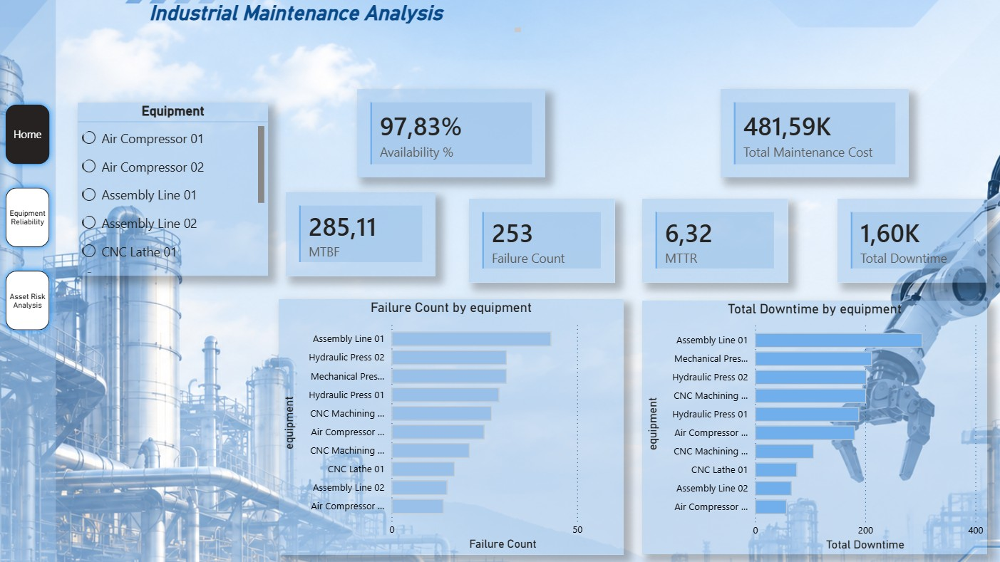
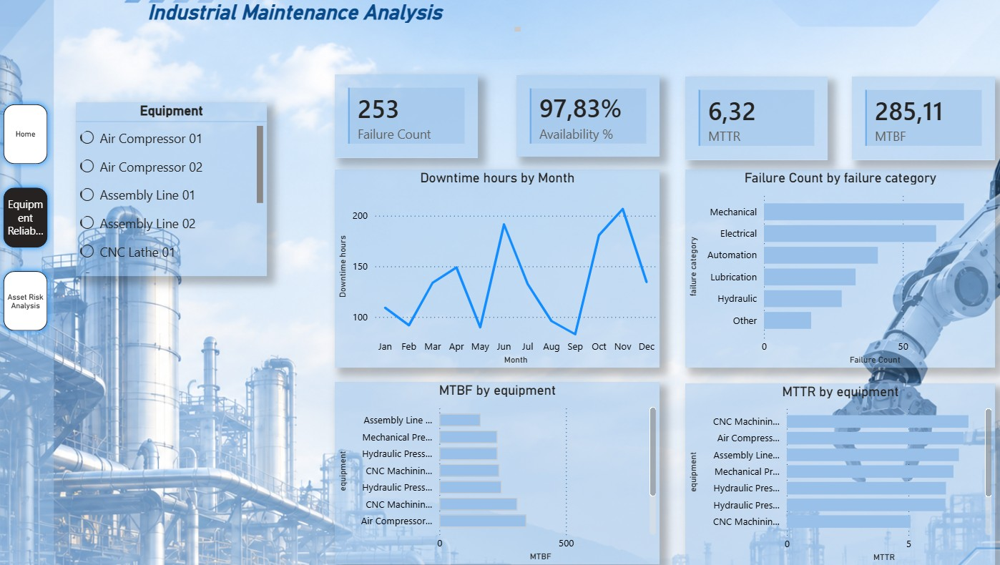
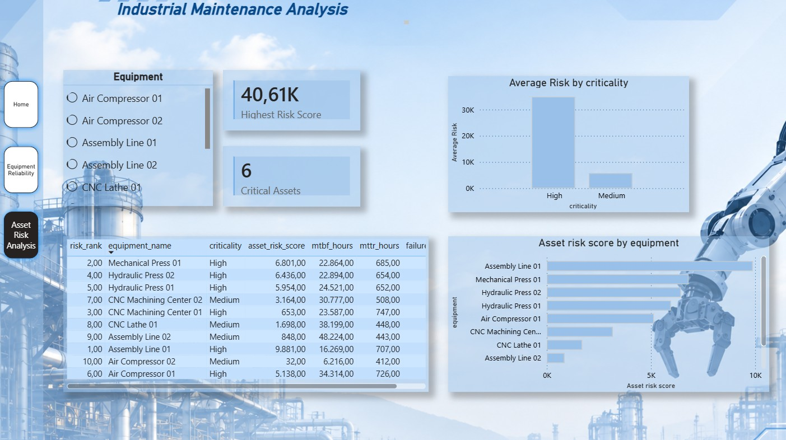

# Industrial Maintenance Analytics

End-to-end data analytics project focused on **industrial maintenance, equipment reliability, and asset risk analysis**.

The project simulates an industrial maintenance environment and demonstrates a complete analytics workflow using **Python, SQL, SQLite, Power BI, and DAX**.

## Project Overview

Industrial maintenance generates large volumes of operational and maintenance data. This project explores how these data can be transformed into actionable information for reliability and maintenance decision-making.

The analysis focuses on:

- Equipment availability
- Failure frequency
- Maintenance downtime
- Maintenance costs
- MTBF (Mean Time Between Failures)
- MTTR (Mean Time To Repair)
- Asset risk prioritization

The dataset used in this project is **synthetically generated** for educational and portfolio purposes.

---

## Analytics Pipeline

```text
Equipment Master Data
        ↓
Synthetic Data Generation
        ↓
      Python
        ↓
Data Validation & Processing
        ↓
 ┌──────────────┬──────────────┐
 ↓              ↓              ↓
SQLite          CSV        KPI Analysis
 ↓              ↓              ↓
SQL Queries ─────────────→ Power BI
                         ↓
                  Maintenance Dashboard
```

---

## Technologies

| Technology | Application |
|---|---|
| Python | Data generation, validation, transformation and KPI calculation |
| Pandas | Data manipulation and aggregation |
| NumPy | Synthetic failure generation |
| Excel | Raw industrial dataset |
| SQLite | Relational maintenance database |
| SQL | Maintenance and reliability analysis |
| Power BI | Data modeling and dashboard development |
| DAX | Interactive maintenance KPIs |
| Git / GitHub | Version control and project documentation |

---

## Maintenance KPIs

### Availability

Measures the proportion of planned production time in which the equipment was operational.

```text
Availability = Operating Hours / Planned Hours
```

### MTBF — Mean Time Between Failures

Indicates the average operating time between equipment failures.

```text
MTBF = Operating Hours / Number of Failures
```

### MTTR — Mean Time To Repair

Measures the average time required to restore equipment after a failure.

```text
MTTR = Corrective Downtime / Number of Failures
```

---

## Asset Risk Score

A custom analytical **Asset Risk Score** was developed to prioritize equipment requiring greater maintenance attention.

The score combines:

- Corrective downtime — 25%
- Failure frequency — 20%
- Availability — 20%
- MTBF — 15%
- MTTR — 10%
- Maintenance cost — 10%

Each component is normalized to a 0–100 scale before weighting.

> The weighting model is a project-defined analytical methodology and is not intended to represent a universal maintenance standard.

---

## Power BI Dashboard

The Power BI report is divided into three analytical views.

### Maintenance Overview

Provides an executive overview of maintenance performance, including failures, downtime, maintenance costs and availability.



### Equipment Reliability

Focuses on equipment reliability through MTBF, MTTR, failure categories and monthly downtime behavior.



### Asset Risk Analysis

Prioritizes industrial assets according to their calculated risk score and supporting reliability indicators.



---

## Project Structure

```text
industrial-maintenance-analytics/
│
├── data/
│   ├── raw/
│   │   └── industrial_maintenance_data.xlsx
│   └── processed/
│       ├── equipment_kpis.csv
│       └── asset_risk_ranking.csv
│
├── database/
│   └── maintenance.db
│
├── dashboard/
│   ├── industrial_maintenance_dashboard.pbix
│   └── screenshots/
│       ├── maintenance_overview.png
│       ├── equipment_reliability.png
│       └── asset_risk_analysis.png
│
├── source/
│   ├── load_data.py
│   ├── generate_synthetic_data.py
│   ├── calculate_kpis.py
│   ├── create_database.py
│   └── run_sql.py
│
├── sql/
│   ├── 01_basic_queries.sql
│   └── 02_maintenance_kpis.sql
│
└── README.md
```

---

## Dataset

The synthetic industrial environment contains:

- **10 industrial assets**
- **253 corrective maintenance work orders**
- **120 monthly operating records**
- Equipment criticality classification
- Failure categories
- Labor and material maintenance costs
- Equipment operating and downtime hours

A fixed random seed is used to make the synthetic dataset reproducible.

---

## Key Project Concepts

This project demonstrates the integration of:

**Industrial Maintenance → Reliability Engineering → Data Analytics → Business Intelligence**

Rather than analyzing maintenance data only through visualization, the project implements the complete data workflow from synthetic data generation and database creation to KPI calculation and interactive reporting.

---

## Author

**Joseane Oliveira**

Industrial Data & Maintenance Analytics# industrial-maintenance-analytics
Maintenance data analysis project focused on reliability, downtime, costs and maintenance KPIs.
